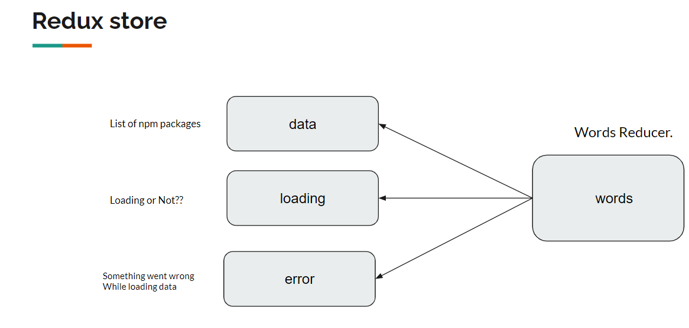

Step 1: Create app using this command: => npx create-react-app react-ts-app --template typescript
Step 2: Move to react-ts-app directory
Step 3: Install following libraries
npm install --save-exact @types/react-redux@7.1.15 axios@0.21.1 react-redux@7.2.2 redux@4.0.5 redux-thunk@2.3.0

### Reducer

### Action Creator, Action Types

### connecting React and Redux

