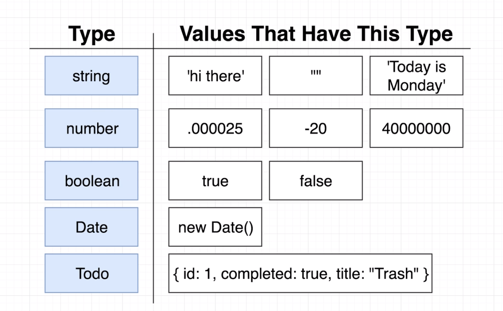
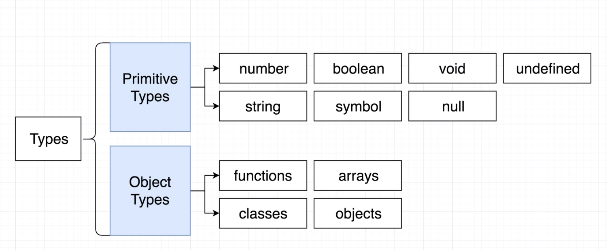
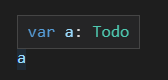
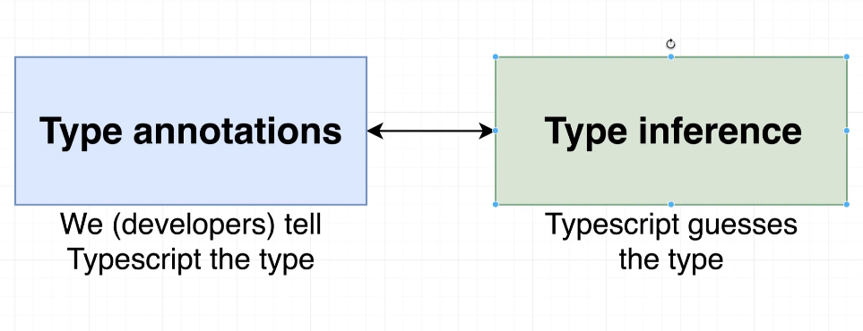
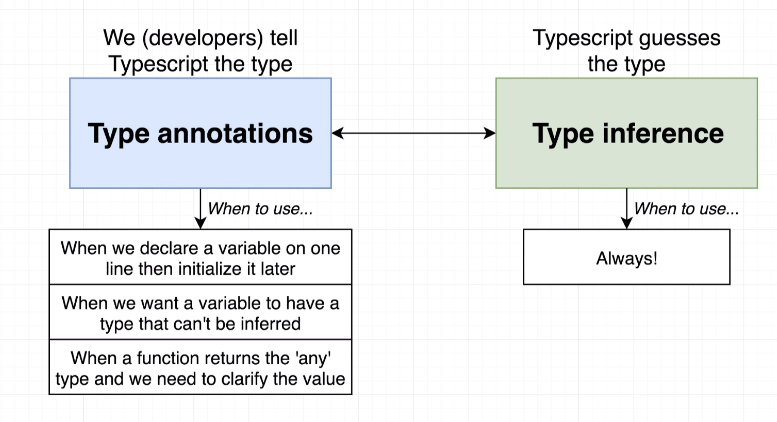

#Typescript installation

Install typescript compiler as a global module
`npm-install -g typescript`
ts-node allows us to execute the typescript in one command in our terminal
`npm-install -g ts-node`
type `tsc` in the terminal to make sure if it is installed.

#### Markdow preview plugin

Plugin name: Markdown Preview Enhanced
open file using `ctrl+shift-v` command

## Class Overview:

#### Typescript Syntax & Design Patterns and Projects

## Types

Every value in the Javascript has a type.

### Types in Typescript

#### Primitive and object types

##### annotation using primitive and object types

    let userName:string = "arjun"
    let istrue:Car = false
    let isNull: null = null
    let isUndefined: undefined = undefined
    let strValues:string[] = []
    let numValues:number[] = []

#### 1) Helps typescript compiler to catch the bug

    var todo = data as Todo;
    todo.xyz ==> this will thow an error.

#### 2) Helps other programmers to easily find the value type.

## Type annotations vs Type inference

##### When to use them:

